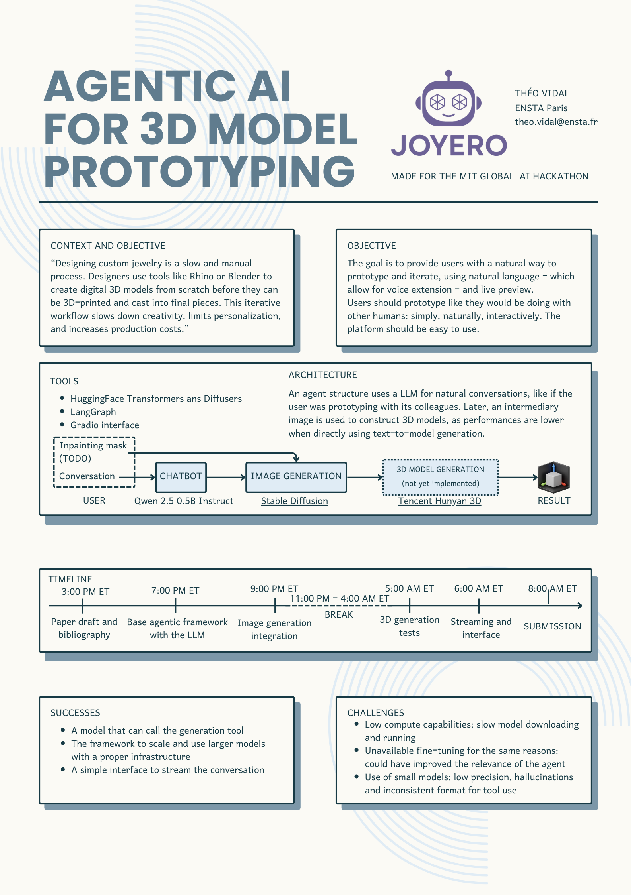

# Joyero

**Agentic AI to naturally and quickly prototype 3D models**

This repository contains my submission for the [MIT Global AI Hackathon 2025](https://www.globalaihackathon.com/), a 17-hours competition that took place on May 3rd to develop a solution based on AI on different subjects. This project is an answer to the following challenge: "Generative 3D Jewelry Design: From Prompt or Image to Printable Shape".

## Installation

- Clone the repository: `git clone https://github.com/theovidal/joyero-mit-hackathon.git`
- Install the 3D-generation model from [the GitHub link](https://github.com/Tencent/Hunyuan3D-2#)
  - Move the library folder `hy3dgen` in the working directory
- Execute the [Joyero-Main](./Joyero-Main.ipynb) notebook